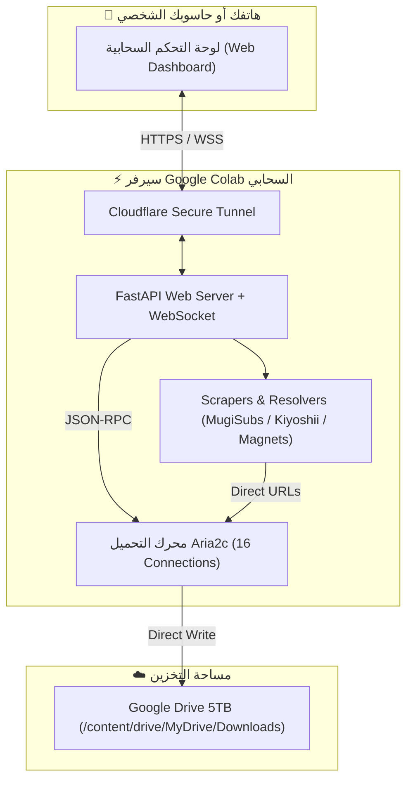

# ⚡ Cloud Ultra Downloader

<p align="center">
  <a href="https://colab.research.google.com/github/ElkampaPro/cloud-ultra-downloader/blob/main/Cloud_Ultra_Downloader.ipynb">
    
  </a>
  
  
  
</p>

<p align="center">
  <b>منصة تحميل سحابي فائقة السرعة مع واجهة ويب حديثة للحفظ المباشر في Google Drive</b><br>
  <i>Ultra-fast cloud downloader with real-time web dashboard, 16-connection acceleration, and auto-save directly to Google Drive.</i>
</p>

---

## 🌟 المميزات الرئيسية (Key Features)

- 🚀 **سرعة تحميل سحابية خارقة (Rocket Speed):**
  - يعتمد على محرك **`aria2c`** مع **16 مسار اتصال متوازي** لكل ملف لاستغلال أقصى سرعة إنترنت في سيرفرات Google Cloud (تصل إلى 100-300+ ميجابايت/ثانية).
- ☁️ **الحفظ المباشر في Google Drive:**
  - يتم حفظ جميع الملفات المنزلة فوراً في مساحة Google Drive (`MyDrive/Downloads` أو أي مجلد فرعي تخصصه) دون استهلاك أي مساحة من جهازك المحلي.
- 📱 **واجهة ويب عصرية وتفاعلية (Modern Web Dashboard):**
  - تصميم داكن فخم (Dark Mode) متجاوب بالكامل مع شاشات الهواتف الذكية وأجهزة الكمبيوتر.
  - مراقبة حية ولحظية للسرعة، النسبة المئوية، الحجم، والوقت المتبقي عبر **WebSocket** دون الحاجة لتحديث الصفحة.
  - أزرار تحكم كاملة: إيقاف مؤقت، استئناف، وإلغاء.
- 🎬 **مستخرج ومحلل فهارس الأنمي (Anime Index Scrapers):**
  - **GoIndex / Cloudflare Workers** (مثل فهارس `MugiSubs`): استخراج جميع الحلقات وروابط التنزيل المباشرة برمجياً.
  - **Vercel OneDrive Index** (مثل فهارس `KiyoshiiSubs`): تخطي جدران الحماية وتحويل الروابط إلى روابط Microsoft المباشرة.
  - نافذة منبثقة لاختيار الحلقات المراد تحميلها بضغطة زر واحدة (Batch Selection).
- 🧲 **دعم كامل لملفات التورنت والمغناطيس (Torrents & Magnets):**
  - سحب وإفلات أو رفع ملفات `.torrent`.
  - لصق روابط المغناطيس `magnet:?xt=...` وبدء التحميل فوراً في السحابة.
- 🛡️ **نفق آمن ومجاني بنقرة واحدة (Cloudflare Tunnel):**
  - تشغيل فوري برابط HTTPS مشفر وآمن لفتح لوحة التحكم من هاتفك في أي مكان بالعالم.

---

## 🏗️ بنية المشروع (Architecture)



---

## 🚀 طريقة الاستخدام في Google Colab (خطوة واحدة)

1. انقر على زر **Open In Colab** في أعلى الصفحة أو افتح ملف [`Cloud_Ultra_Downloader.ipynb`](./Cloud_Ultra_Downloader.ipynb).
2. قم بتشغيل الخلية **الخطوة 1** للموافقة على ربط Google Drive.
3. قم بتشغيل الخلية **الخطوة 2** لتثبيت الحزم ومحرك `aria2c`.
4. قم بتشغيل الخلية **الخطوة 3**: سيظهر لك زر أنيق ورابط مباشر `https://xxxx.trycloudflare.com`.
5. افتح الرابط من هاتفك أو متصفحك، الصق أي رابط، واستمتع بالتحميل السحابي فائق السرعة!

---

## 💻 التشغيل المحلي (Local Development)

إذا أردت تشغيل المشروع على جهازك الشخصي:

```bash
# 1. استنساخ المستودع
git clone https://github.com/ElkampaPro/cloud-ultra-downloader.git
cd cloud-ultra-downloader

# 2. تثبيت الحزم
pip install -r requirements.txt

# 3. تشغيل على Linux / Mac
bash scripts/start.sh

# أو تشغيل على Windows
scripts\start.bat
```

افتح المتصفح على: `http://localhost:8000`

---

## 📁 هيكلية الملفات (Repository Structure)

```text
cloud-ultra-downloader/
├── app/
│   ├── aria2_manager.py     # إدارة عملية aria2c والعميل غير المتزامن JSON-RPC
│   ├── config.py            # إعدادات المجلدات ومساحة القرص
│   ├── main.py              # خادم FastAPI، مسارات API، وبث WebSocket
│   └── resolvers/
│       ├── base.py          # الفئة الأساسية للمحللات
│       ├── generic.py       # الروابط المباشرة والمغناطيسية
│       ├── kiyoshii.py      # محلل فهارس Vercel و OneDrive
│       ├── mugisubs.py      # محلل فهارس MugiSubs و GoIndex
│       └── resolver_hub.py  # موجه الروابط الذكي
├── static/
│   ├── app.js               # منطق الواجهة الأمامية والاتصال المباشر
│   ├── index.html           # واجهة المستخدم الداكنة التفاعلية
│   └── style.css            # التحسينات البصرية والرسوم المتحركة
├── colab/
│   └── Cloud_Ultra_Downloader.ipynb # دفتر Colab للتشغيل المباشر
├── scripts/
│   ├── start.sh             # سكريبت بدء التشغيل على Linux / Colab
│   └── start.bat            # سكريبت بدء التشغيل على Windows
├── Cloud_Ultra_Downloader.ipynb # نسخة الدفتر في الجذر لسهولة الوصول
├── requirements.txt         # مكتبات بايثون المطلوبة
└── README.md
```

---

## 📄 الترخيص (License)

هذا المشروع مرخص تحت رخصة **MIT**.
